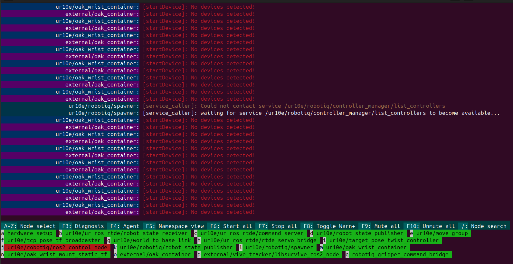
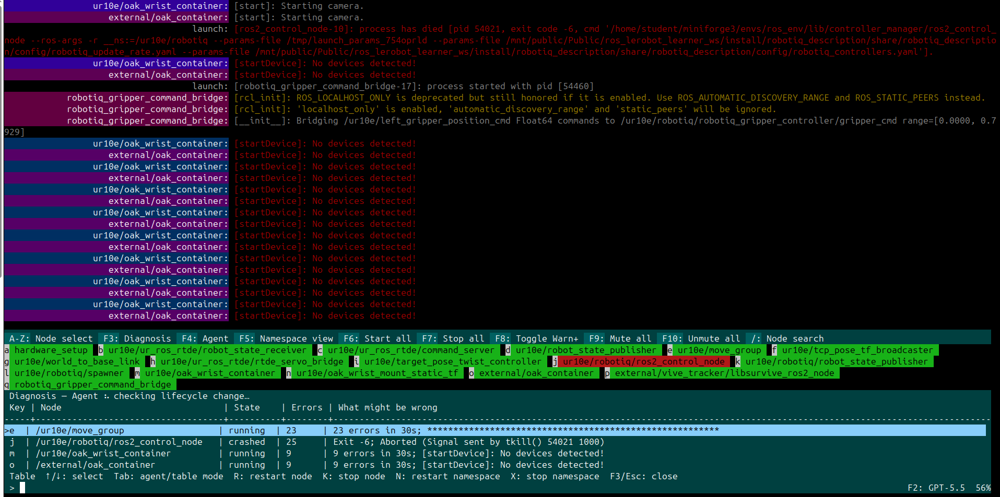
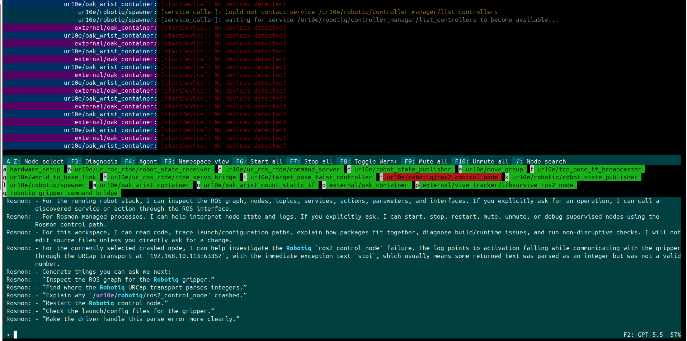

# rosmon2

`rosmon2` is a rosmon-style launcher and terminal process monitor for ROS 2.
It runs launch files through the native ROS 2 `launch` engine, so existing
Python, XML, and YAML launch files keep their normal arguments, substitutions,
and includes.

`rosmon2` is inspired by [xqms/rosmon](https://github.com/xqms/rosmon), but is
an independent ROS 2 implementation and does not require ROS 1.


## Screenshot




## Installation and quick start

### Install with pip

`rosmon2` uses the ROS 2 Python launch APIs, so install ROS 2 first and source
the selected distribution before running it. A pip installation installs
`rosmon2`; it does not install ROS 2 itself.

Published releases can be installed from PyPI:

```bash
source /opt/ros/${ROS_DISTRO}/setup.bash
python3 -m pip install rosmon2
```

Until the first PyPI release is published, install the current `main` branch
directly from GitHub:

```bash
source /opt/ros/${ROS_DISTRO}/setup.bash
python3 -m pip install \
  'git+https://github.com/GibsonHu/rosmon2.git@main'
```

When using a virtual environment, expose both the system ROS packages and the
virtual environment's ament resource index:

```bash
python3 -m venv --system-site-packages ~/.venvs/rosmon2
source ~/.venvs/rosmon2/bin/activate
source /opt/ros/${ROS_DISTRO}/setup.bash
export AMENT_PREFIX_PATH="$VIRTUAL_ENV${AMENT_PREFIX_PATH:+:$AMENT_PREFIX_PATH}"
python -m pip install rosmon2
```

Then launch the included demo:

```bash
mon2 launch rosmon2 demo.launch.py
```

### Install in a ROS workspace

Add this repository to a ROS 2 workspace, install its dependencies, and build
it with `colcon`:

```bash
mkdir -p ~/ros2_ws/src
cd ~/ros2_ws/src
git clone https://github.com/GibsonHu/rosmon2.git

cd ~/ros2_ws
source /opt/ros/${ROS_DISTRO}/setup.bash
rosdep install --from-paths src --ignore-src -r -y
colcon build --packages-select rosmon2
source install/setup.bash
```

Then launch the included talker/listener demo:

```bash
mon2 launch rosmon2 demo.launch.py
```

Launch arguments use the standard ROS 2 `name:=value` syntax:

```bash
mon2 launch rosmon2 demo.launch.py namespace:=demo
```

You can launch a file by package and filename, as above, or by path:

```bash
mon2 launch path/to/system.launch.py use_sim_time:=true
```

The `rosmon2` executable is an alias for `mon2`, so this is equivalent:

```bash
rosmon2 launch rosmon2 demo.launch.py
```

## Publishing a PyPI release

The `publish-pypi.yml` GitHub Actions workflow builds and validates a wheel and
source distribution for version tags, then publishes them with PyPI Trusted
Publishing.

Before the first release, register a pending PyPI Trusted Publisher with:

- PyPI project name: `rosmon2`
- GitHub owner: `GibsonHu`
- GitHub repository: `rosmon2`
- Workflow: `publish-pypi.yml`
- Environment: `pypi`

The Python distribution reads its version from `package.xml`; keep
`rosmon2/__init__.py` synchronized with it. The test suite and publishing
workflow check this automatically. Commit the version change, then push a
matching tag:

```bash
git tag -a v0.1.0 -m "rosmon2 0.1.0"
git push origin v0.1.0
```

PyPI release files are immutable. Increment the version before publishing a
replacement release.

## Terminal controls

While a launch is running, the status bar shows each process and its state.
Select a process with its displayed key (`a-z`, `A-Z`, or `0-9`), then press:

| Key | Action |
| --- | --- |
| `s` | Start the selected process |
| `k` | Stop the selected process |
| `m` | Mute the selected process |
| `u` | Unmute the selected process |
| `d` | Start the selected process under `gdb` |

Global controls are available without selecting a process:

| Key | Action |
| --- | --- |
| `F3` | Open or close Diagnosis |
| `F4` | Open or close the embedded Agent |
| `F5` | Toggle namespace mode |
| `F6` | Start all processes |
| `F7` | Stop all processes |
| `F8` | Toggle WARN-and-higher output |
| `F9` | Mute all process output |
| `F10` | Unmute all process output |
| `/` | Search nodes by full name |
| `Ctrl-C` | Gracefully stop the complete launch |

Node search matches substrings against full names, including namespaces. Type
`/` to start searching, use `Tab` or the arrow keys to select a match, and
press `Enter` to open its node actions. Press `Escape` to cancel the search.

<details>
<summary><strong>Diagnosis</strong></summary>



- Press `F3` to open or close Diagnosis.
- The first health check runs immediately; later Agent checks run only when a
  node's lifecycle or health state changes.
- The normal node GUI stays visible, while the table lists only unhealthy,
  stopped, stalled, crashed, or high-error nodes.
- Each row shows the node key, name, state, recent error count, and a short
  `What might be wrong` hint.
- Ask about a selected node or refer to it by its displayed letter; Rosmon
  automatically supplies its state and recent logs.
- Answers stream as dot points under `What might be wrong`, `Hardware`, and
  `Software`.
- Repairable software diagnoses end with a `[y/n]` choice; hardware, mixed, and
  uncertain diagnoses do not offer an automatic repair.
- Use Up/Down to select a table row.
- Press `Tab` to switch Up/Down between the table and Agent text; use Page
  Up/Page Down to scroll a full page.
- With an empty prompt, press `R` to restart the selected node, `K` to stop it,
  `N` to restart its namespace, or `X` to stop its namespace.
- Automatic checks are read-only; node actions and repairs require a direct
  Human request.
- Diagnosis has its own conversation history, separate from the F4 Agent.

</details>

<details>
<summary><strong>Embedded Agent</strong></summary>



- Install and authenticate the
  [Codex CLI](https://learn.chatgpt.com/docs/non-interactive-mode); Rosmon reuses
  its login and never stores an API key.
- Press `F4` for open-ended ROS, launch, workspace, code, testing, and node
  control requests.
- Rosmon automatically supplies the live node state, selected-node context,
  and relevant logs; node letters can be used as references.
- Responses stream while the launch continues, with a spinner and live
  `Reading`, `Searching`, `Editing`, `Running`, or `Executing` activity.
- While reasoning, the current user-visible analysis or operation is shown on
  the spinner row and clipped to the terminal width; hidden chain-of-thought
  is not displayed.
- Completed analysis and operation steps remain in the scrollable conversation
  with a `✓` marker. The spinner moves below them for the current or next step.
- Press `F2` or enter `/model` to choose the shared Agent and Diagnosis model,
  permissions, and account action. `Models` and `Permissions` open nested
  option lists. The account row shows `Log in` while logged out and `Log out`
  while logged in; login opens the browser for Codex authentication. When
  logged out, Agent and Diagnosis requests pause and ask you to log in first.
  Opening Agent with `F4` while logged out highlights `Log in`, so pressing
  `Enter` starts browser authentication immediately. GPT-5.5 and `Full access`
  are selected initially, and every model uses medium reasoning effort.
- `Approve for me` routes applicable approval requests to Codex auto-review;
  `Full access` uses no approval prompts. Agent shell execution remains
  unsandboxed on this host to avoid its unsupported Bubblewrap user namespace.
- Diagnosis remains filesystem read-only in either Agent access mode.
- The confirmed F2 model and access selections persist across launches in
  `~/.config/rosmon2/agent-settings.json`.
- The input row shows the selected model and remaining Codex usage percentage;
  `--%` means usage is unavailable.
- Agent and Diagnosis output is append-only and remains scrollable with
  Up/Down or Page Up/Page Down. Opening a panel does not preallocate blank
  transcript rows, and an active response does not pull a scrolled view back
  to the newest line.
- Press `F3` from Agent to switch directly to Diagnosis, or `F4` from Diagnosis
  to switch directly to Agent.
- Global controls `F5`–`F10` remain available while either panel is open.
- Direct requests can start, stop, restart, mute, unmute, or debug nodes through
  Rosmon's validated controls.
- The Agent can inspect ROS nodes, topics, services, actions, interfaces, and
  parameters; direct requests can also call services or send action goals.
- Direct requests can create and start validated Python ROS nodes inside the
  dedicated `~/rosmon2` folder; Rosmon creates the folder when needed, and
  managed Agent-created nodes appear orange while running. Their waiting,
  stopped, and crashed states use the normal node colors.
- Source edits happen only when directly requested; Agent mode runs without
  Codex's Bubblewrap sandbox so shell commands, ROS networking, workspace
  writes, and `/tmp` work on hosts that disable user namespaces.
- Automatic Diagnosis checks remain read-only.
- Robot motion requires a discoverable live interface and explicit target,
  direction, distance, and safety-critical values.
- Omitted speed and acceleration use discovered controller defaults; safety
  limits, interlocks, raw effort, torque, and velocity cannot be bypassed.
- Source ROS and the workspace before starting `mon2` so ROS tools and interface
  packages are available.
- Use `--codex-workspace PATH` to select a different source workspace.
- Use `--codex-command PATH` when the Codex executable has another name or is
  not on `PATH`.

</details>

<details>
<summary><strong>Namespace View</strong></summary>

Namespace view groups processes by their top-level ROS namespace, including
nodes in child namespaces. Each namespace displays `[alive:dead]` process
counts. Its background is green when all processes are alive, yellow when only
some are alive, and red when all are dead.

Select a namespace with its displayed key, then press:

| Key | Namespace action |
| --- | --- |
| `s` | Start every process in the namespace |
| `k` | Stop every process in the namespace |
| `m` | Mute output from the namespace |
| `u` | Unmute output from the namespace |
| `i` | Inspect and control the individual processes |
| `Backspace` | Return from inspection to the namespace list |

</details>

<details>
<summary><strong>Advanced usage</strong></summary>

### Command-line options

Run without the interactive terminal UI:

```bash
mon2 launch --disable-ui rosmon2 demo.launch.py
```

List the arguments declared by a launch file:

```bash
mon2 launch --list-args rosmon2 demo.launch.py
```

Load a launch description and exit, which is useful for benchmarking launch
file parsing:

```bash
mon2 launch --benchmark rosmon2 demo.launch.py
```

Discover processes without leaving them running:

```bash
mon2 launch --no-start rosmon2 demo.launch.py
```

Write combined stdout and stderr to a chosen file:

```bash
mon2 launch --log ./system.log --flush-log my_package system.launch.py
```

By default, process output is also written to a timestamped file under
`/tmp/rosmon2_*.log`. Use `mon2 launch --help` to see every option.

### Agent control and JSON output

Every launch creates a private local Unix-socket session. Name the session so
another terminal, a script, or a coding agent can inspect and control the same
supervisor:

```bash
# Terminal 1
mon2 launch --session hardware rs_launch hardware.launch.py

# Terminal 2
mon2 status --session hardware --json
mon2 logs --session hardware --namespace /ur10e \
  --severity ERROR --since 120 --json
mon2 restart --session hardware \
  --node /ur10e/ur_ros_rtde/command_server --json
mon2 wait --session hardware --namespace /ur10e \
  --state running --timeout 60 --json
```

The available control commands are:

| Command | Purpose |
| --- | --- |
| `status` | Return node, namespace, PID, state, exit-code, and mute information |
| `logs` | Query the in-memory structured process log |
| `events` | Stream live JSON events from the supervisor |
| `start`, `stop`, `restart` | Control a node, namespace, or every process |
| `mute`, `unmute` | Control process output without stopping it |
| `wait` | Wait deterministically for matching processes to reach a state |

Mutating commands require exactly one explicit target:
`--node FULL_NAME`, `--namespace NAMESPACE`, or `--all`. Session names map to
sockets under `$XDG_RUNTIME_DIR/rosmon2`, or `/tmp/rosmon2-$UID` when no XDG
runtime directory is available. The directory and socket are accessible only
to the current user.

The socket API uses protocol version 1: one UTF-8 JSON request and response per
line. For example, sending
`{"command":"restart","node":"/ur10e/command_server"}` performs the same action
as the `mon2 restart` command. An `events` request first returns a subscription
acknowledgement and then streams event objects until disconnected. The CLI is
the supported client and avoids requiring callers to handle socket paths or
protocol framing themselves.

For a continuous, machine-readable launch stream, use:

```bash
mon2 launch --session hardware --json-events \
  rs_launch hardware.launch.py
```

`--json-events` disables the interactive TUI and writes one JSON object per
line. Events include session startup/shutdown, process starts/exits, control
actions, and structured log records. `mon2 events --session hardware` can
subscribe to the same stream from another process. Use `--no-control` only
when no external session socket is wanted.

The TUI, JSON CLI, and MCP server all use the same supervisor:

```text
ROS 2 launch processes
          |
    rosmon2 supervisor
      /       |       \
    TUI   JSON CLI   MCP server
```

</details>

<details>
<summary><strong>MCP usage</strong></summary>

### MCP integration

`rosmon2-mcp` is a dependency-free MCP stdio server implementing protocol
revision `2025-06-18`. It exposes these tools:

- `rosmon2_status`, `rosmon2_logs`, and `rosmon2_wait`
- `rosmon2_start`, `rosmon2_stop`, and `rosmon2_restart`
- `rosmon2_mute` and `rosmon2_unmute`

After building the workspace, register it with Codex from the workspace root.
The explicit setup and runtime paths let Codex use the server when it is
started from another repository:

```bash
rosmon2_setup="$(realpath install/setup.bash)"
if [[ -n "${XDG_RUNTIME_DIR:-}" ]]; then
  rosmon2_runtime_dir="$XDG_RUNTIME_DIR/rosmon2"
else
  rosmon2_runtime_dir="/tmp/rosmon2-$UID"
fi

codex mcp add rosmon2 \
  --env ROSMON2_SETUP="$rosmon2_setup" \
  --env ROSMON2_RUNTIME_DIR="$rosmon2_runtime_dir" \
  -- bash -lc 'source "$ROSMON2_SETUP" && exec rosmon2-mcp'
codex mcp list
```

If `rosmon2` was registered previously with only
`codex mcp add rosmon2 -- rosmon2-mcp`, remove that entry with
`codex mcp remove rosmon2` before registering it again.

### Test with Codex CLI

Start a named rosmon2 session in one terminal:

```bash
source install/setup.bash
mon2 launch --session demo rosmon2 demo.launch.py
```

In a second terminal, from any workspace, ask Codex to inspect the session
through MCP:

```bash
codex exec \
  'Use the rosmon2 MCP server to inspect session "demo". Call rosmon2_status and summarize which processes are running.'
```

Codex should call the read-only `rosmon2_status` tool with
`{"session": "demo"}` and report the demo processes. To test interactively,
run `codex`, enter `/mcp` to confirm that `rosmon2` is active, and then enter
the same request.

The MCP process does not launch or own ROS nodes. It translates typed MCP tool
calls into requests to the named rosmon2 session, so closing the MCP client
does not stop the robot launch. Start rosmon2 with `--session hardware`, then
pass `"session": "hardware"` to the tools. Read-only MCP tools are annotated
accordingly, while start/stop/restart/mute operations require an explicit
node, namespace, or `all: true` target.

</details>

## Building from source

`rosmon2` is an `ament_python` package. If the repository is your workspace
root, build it from that directory. If it is inside a workspace's `src/`
directory, run `colcon build` from the workspace root:

```bash
source /opt/ros/${ROS_DISTRO}/setup.bash
colcon build --packages-select rosmon2
source install/setup.bash
```

To run the tests:

```bash
colcon test --packages-select rosmon2
colcon test-result --verbose
```

If packages installed in `~/.local` override your ROS 2 or workspace build
tools, repeat the build with `PYTHONNOUSERSITE=1` in the environment.

## License

`rosmon2` is licensed under the [BSD 3-Clause License](LICENSE).
